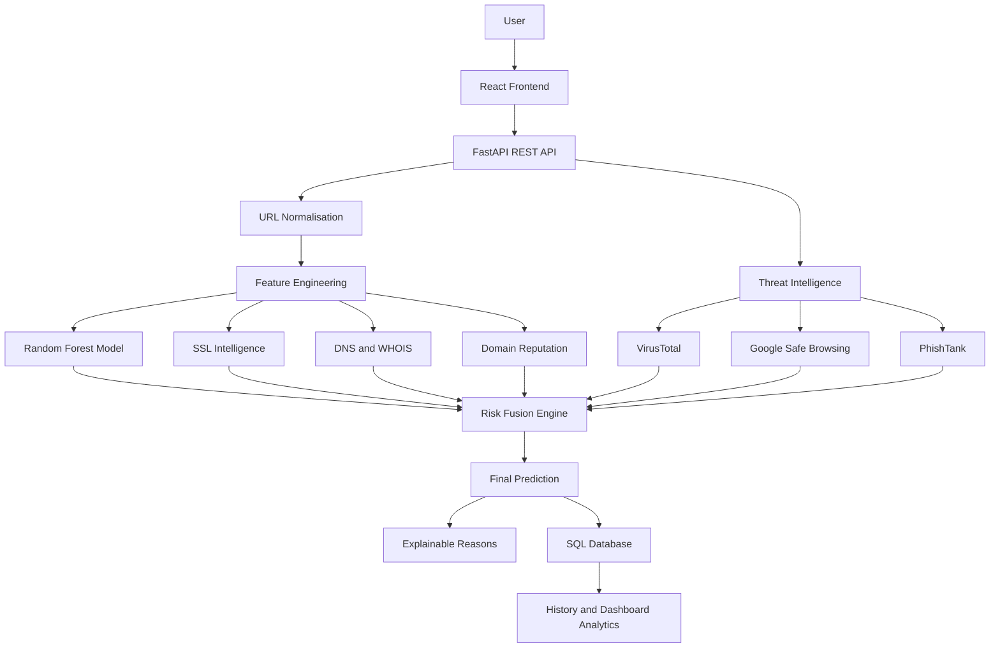
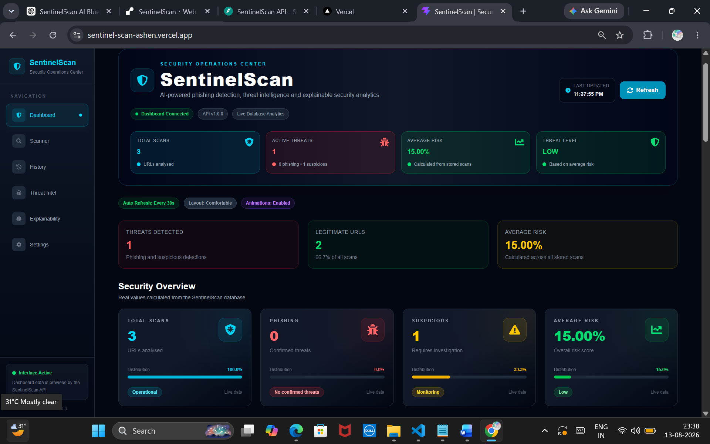
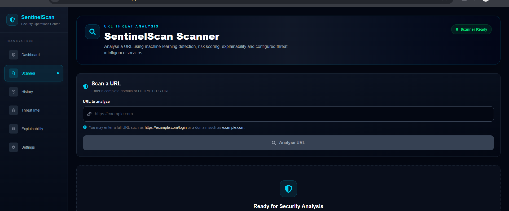
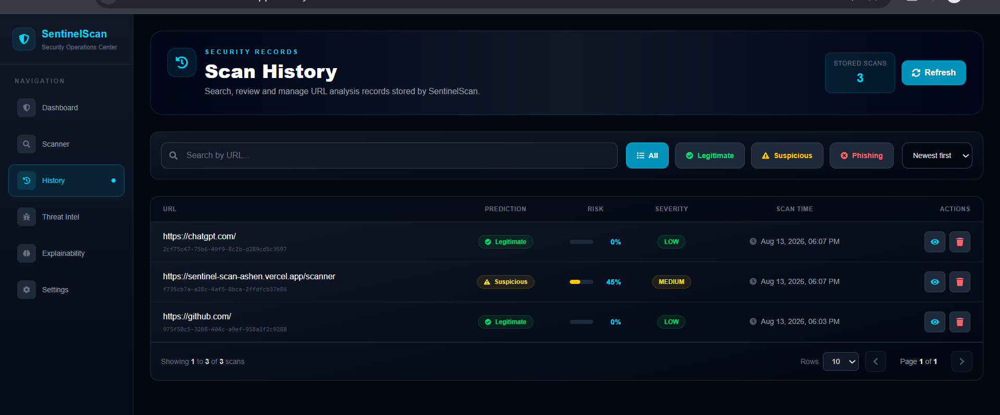
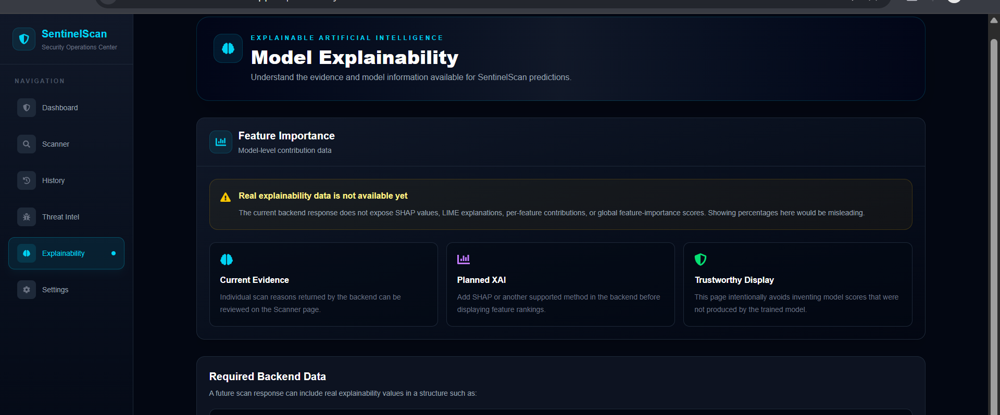
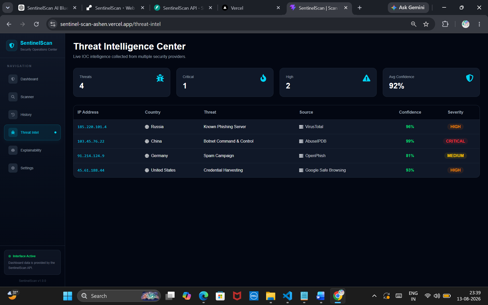

# SentinelScan

<div align="center">

### AI-Powered Phishing URL Detection and Security Analytics Platform

SentinelScan combines machine learning, URL feature engineering, domain intelligence, threat-intelligence feeds, risk scoring, explainable AI, and dashboard analytics to identify potentially malicious URLs.

<br>


</div>

---

## Overview

**SentinelScan** is an end-to-end phishing URL detection platform developed using React, FastAPI, machine learning, SQLAlchemy, and threat-intelligence services.

A submitted URL is analysed using:

- Machine-learning classification
- 31 engineered URL and domain features
- SSL certificate intelligence
- DNS and WHOIS information
- Domain reputation
- URL behavioural heuristics
- Threat-intelligence sources
- Risk-score calculation
- Explainable detection reasons

The final result includes a prediction, confidence score, risk score, severity level, threat-intelligence summary, and human-readable explanations.

---

## Key Features

- Real-time phishing URL scanning
- Random Forest machine-learning model
- 31-feature security analysis pipeline
- Confidence-based ML prediction
- Risk-fusion engine
- Explainable detection reasons
- SSL, DNS, WHOIS, and domain-reputation analysis
- VirusTotal integration support
- Google Safe Browsing integration support
- PhishTank lookup support
- Scan-history management
- Dashboard statistics and visualisations
- Prediction and risk distributions
- Top scanned domains
- Daily scan trends
- REST API with Swagger and ReDoc
- API-key authentication
- Responsive React user interface
- SQLite development database
- PostgreSQL-ready deployment configuration

---

## System Architecture



---

## Detection Workflow

1. The user submits a URL through the React scanner.
2. The backend validates and normalises the URL.
3. SentinelScan extracts 31 security features.
4. The Random Forest model predicts whether the URL is legitimate or phishing.
5. SSL, DNS, WHOIS, domain reputation, and URL behaviour are analysed.
6. External threat-intelligence signals are collected when available.
7. The risk-fusion engine calculates a risk score from 0 to 100.
8. A final verdict and severity level are generated.
9. Human-readable reasons explain the decision.
10. The result is stored and displayed in history and dashboard analytics.

---

## Machine-Learning Features

SentinelScan uses 31 features divided into multiple groups.

### URL Structure

- URL length
- Domain length
- Path length
- Query length
- Number of dots
- Number of hyphens
- Number of digits
- Number of special characters
- Number of subdomains
- Top-level-domain length

### URL Behaviour

- IP address usage
- `@` symbol presence
- HTTPS usage
- URL encoding
- Shannon entropy
- Suspicious-keyword count
- Brand-keyword count

### Domain Intelligence

- Domain age
- WHOIS-record availability
- Registrar availability
- Free-domain detection
- TLD risk score

### DNS Intelligence

- DNS-record availability
- A-record count
- MX-record availability
- Name-server count

### SSL and TLS Intelligence

- SSL certificate validity
- Certificate age
- Certificate expiry
- Known issuer
- TLS version score

---

## Machine-Learning Model Evaluation

| Model | Accuracy | Precision | Recall | F1 Score | ROC-AUC |
|---|---:|---:|---:|---:|---:|
| Logistic Regression | 99.08% | 99.65% | 97.36% | 98.49% | 99.79% |
| Random Forest | **99.84%** | 99.89% | 99.58% | **99.73%** | 99.84% |
| XGBoost | 99.82% | 99.94% | 99.48% | 99.71% | **99.93%** |
| LightGBM | 99.82% | 99.89% | 99.53% | 99.71% | 99.92% |
| CatBoost | 99.82% | 99.95% | 99.45% | 99.70% | 99.92% |

### Selected Model

**Random Forest** was selected for deployment because it offered:

- Highest recorded accuracy among the evaluated models
- Strong precision and recall
- Fast inference
- Reliable performance with tabular features
- Straightforward feature-importance analysis
- Easy integration with the FastAPI backend

> These results are based on the project dataset and evaluation pipeline. Performance on unseen real-world data may differ.

---

## Risk Classification

| Risk Score | Severity | Final Classification |
|---:|---|---|
| 0–24 | Low | Legitimate |
| 25–49 | Medium | Suspicious |
| 50–79 | High | Suspicious |
| 80–100 | Critical | Phishing |

The final verdict is not based only on the raw machine-learning output. SentinelScan combines multiple security signals through its risk-fusion engine.

---

## Screenshots

### Dashboard



### URL Scanner



### Scan Result


### Scan History



### Explainable AI



### Threat Intelligence



### Swagger API Documentation


> Screenshots will appear after the corresponding image files are added inside the `assets` directory.

---

## Technology Stack

### Frontend

- React
- Vite
- Tailwind CSS
- Axios
- React Router
- Recharts
- React Hot Toast
- React Icons

### Backend

- Python 3.11
- FastAPI
- Pydantic
- SQLAlchemy
- Uvicorn

### Machine Learning

- Scikit-learn
- Random Forest
- Logistic Regression
- XGBoost
- LightGBM
- CatBoost
- Pandas
- NumPy
- Joblib

### Security Intelligence

- SSL certificate analysis
- DNS lookup
- WHOIS lookup
- Domain reputation
- VirusTotal support
- Google Safe Browsing support
- PhishTank support

### Database

- SQLite for local development
- PostgreSQL-ready production configuration

---

## Project Structure

```text
SentinelScan/
│
├── database/
│   ├── analytics_crud.py
│   ├── crud.py
│   ├── database.py
│   ├── models.py
│   └── serializers.py
│
├── data/
│   ├── metadata/
│   ├── processed/
│   └── raw/
│
├── frontend/
│   ├── public/
│   ├── src/
│   │   ├── components/
│   │   ├── hooks/
│   │   ├── pages/
│   │   ├── services/
│   │   └── App.jsx
│   ├── package.json
│   └── vite.config.js
│
├── models_saved/
│   ├── RandomForest.pkl
│   └── preprocessor.pkl
│
├── src/
│   ├── api/
│   ├── dashboard/
│   ├── feature_engineering/
│   ├── model_training/
│   ├── prediction/
│   ├── risk_engine/
│   ├── threat_intelligence/
│   └── utils/
│
├── assets/
├── .env.example
├── .gitignore
├── requirements.txt
└── README.md
```

---

## API Endpoints

| Method | Endpoint | Description | Authentication |
|---|---|---|---|
| GET | `/` | API information | No |
| GET | `/health` | Service-health status | No |
| POST | `/scan` | Analyse and store a URL | API key |
| GET | `/history` | Retrieve scan history | API key |
| GET | `/scan/{scan_id}` | Retrieve one scan | API key |
| DELETE | `/scan/{scan_id}` | Delete one scan | API key |
| GET | `/statistics` | Retrieve aggregate statistics | API key |
| GET | `/dashboard` | Retrieve dashboard payload | API key |
| GET | `/analytics/prediction-distribution` | Prediction counts | API key |
| GET | `/analytics/risk-distribution` | Risk-range counts | API key |
| GET | `/analytics/top-domains` | Most scanned domains | API key |

---

## Local Installation

### Prerequisites

Install:

- Python 3.11
- Node.js 18 or later
- Git

### 1. Clone the repository

```bash
git clone https://github.com/darshnoor30/SentinelScan.git
cd SentinelScan
```

### 2. Create a Python virtual environment

#### Windows PowerShell

```powershell
python -m venv venv
.\venv\Scripts\Activate.ps1
```

#### macOS or Linux

```bash
python3 -m venv venv
source venv/bin/activate
```

### 3. Install backend dependencies

```bash
pip install -r requirements.txt
```

### 4. Create the backend environment file

Copy:

```text
.env.example
```

to:

```text
.env
```

Example configuration:

```env
ENVIRONMENT=development
SENTINELSCAN_API_KEY=sentinelscan-development-key
DATABASE_URL=sqlite:///./data/sentinelscan.db
FRONTEND_URLS=http://localhost:5173,http://127.0.0.1:5173

VIRUSTOTAL_API_KEY=
GOOGLE_SAFE_BROWSING_API_KEY=
PHISHTANK_API_KEY=
```

### 5. Start the FastAPI backend

```bash
python -m uvicorn src.api.main:app --host 127.0.0.1 --port 8001
```

Backend URLs:

```text
API:      http://127.0.0.1:8001
Swagger:  http://127.0.0.1:8001/docs
ReDoc:    http://127.0.0.1:8001/redoc
Health:   http://127.0.0.1:8001/health
```

### 6. Install frontend dependencies

Open another terminal:

```bash
cd frontend
npm install
```

### 7. Create the frontend environment file

Create:

```text
frontend/.env
```

with:

```env
VITE_API_BASE_URL=http://127.0.0.1:8001
VITE_SENTINELSCAN_API_KEY=sentinelscan-development-key
```

The frontend and backend API-key values must match.

### 8. Start the React frontend

```bash
npm run dev
```

Open:

```text
http://localhost:5173
```

---

## Example API Request

```bash
curl -X POST \
  "http://127.0.0.1:8001/scan" \
  -H "accept: application/json" \
  -H "Content-Type: application/json" \
  -H "X-API-Key: sentinelscan-development-key" \
  -d '{"url":"https://github.com"}'
```

Example response:

```json
{
  "url": "https://github.com/",
  "raw_ml_prediction": "0",
  "ml_prediction": "LEGITIMATE",
  "prediction": "LEGITIMATE",
  "confidence": 99.78,
  "risk_score": 0,
  "severity": "LOW",
  "reasons": [
    "Machine learning model found no major phishing indicators",
    "Valid SSL certificate detected",
    "Trusted domain reputation was detected"
  ]
}
```

---

## API Authentication

Protected routes require:

```http
X-API-Key: your-api-key
```

The frontend currently uses a Vite environment variable to send the key.

Because variables prefixed with `VITE_` are included in browser builds, this API-key mechanism should be treated as a demonstration-level access control, not as complete user authentication.

Production improvements could include:

- User accounts
- JWT authentication
- OAuth
- Role-based access control
- API-key rotation
- Rate limiting

---

## Deployment Architecture

```text
React Frontend
      |
      v
Vercel Deployment
      |
      v
FastAPI Backend
      |
      v
Render Web Service
      |
      v
PostgreSQL Database
```

Deployment links will be added after production deployment.

```text
Frontend: Coming soon
Backend:  Coming soon
Swagger:  Coming soon
```

---

## Security Considerations

- User input is validated before analysis.
- Only HTTP and HTTPS URLs are accepted.
- Local and private IP addresses can be restricted.
- API keys are loaded through environment variables.
- Secrets and `.env` files must not be committed.
- Database sessions are closed after every request.
- CORS origins are configurable.
- Model and preprocessor schemas are validated.
- Scan identifiers use UUID values.
- Errors are logged without exposing internal stack traces to API users.

---

## Limitations

- External threat-intelligence APIs may be unavailable without API keys.
- A machine-learning prediction is probabilistic and may produce false positives or false negatives.
- WHOIS, DNS, and SSL checks depend on network availability.
- SQLite is suitable for local development but not ideal for a scalable deployment.
- Trusted-domain reputation lists require regular maintenance.
- New phishing domains may not yet appear in blacklist services.

---

## Future Scope

- Browser extension
- Email phishing detection
- QR-code phishing detection
- Mobile application
- Real-time blacklist updates
- Deep-learning URL classification
- Transformer-based phishing analysis
- SHAP-based model explanations
- SOC and SIEM integration
- User accounts and role-based access
- Automated alert notifications
- Docker and Kubernetes deployment
- Continuous model retraining
- PostgreSQL production database
- Cloud-based monitoring and logging

---

## Responsible Use

SentinelScan is intended for:

- Cybersecurity education
- Defensive security research
- Phishing-awareness demonstrations
- URL-risk analysis
- Academic project work

It should not be treated as the only security control for high-risk or production decisions.

---

## Author

**Darshnoor Kaur**

- B.Tech Computer Science Engineering
- Cybersecurity and Machine-Learning Enthusiast
- GitHub: [@darshnoor30](https://github.com/darshnoor30)

---

## License

This project is intended for educational and academic use.

Add an open-source license before permitting unrestricted redistribution.

---

<div align="center">

### SentinelScan

Machine Learning + Threat Intelligence + Risk Scoring + Explainable AI

</div>