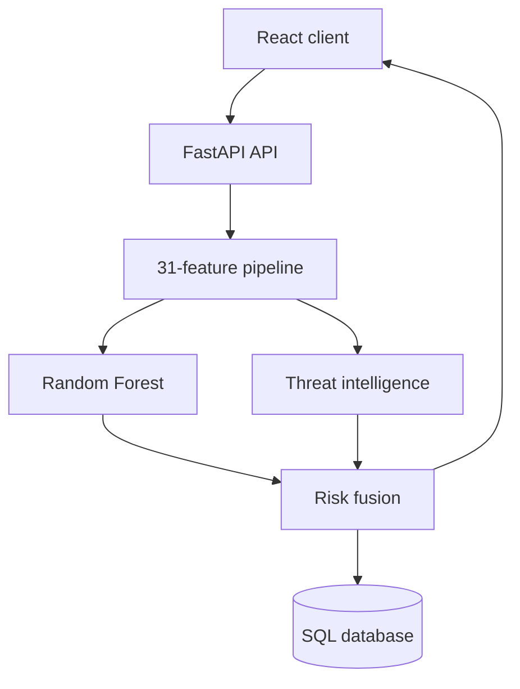

# SentinelScan Architecture

SentinelScan is split into a browser client, an authenticated API, a deterministic
feature pipeline, a model/risk layer, and persistence. External intelligence is
optional: provider failures produce availability signals instead of taking down the
core scanner.

## Trust boundaries

| Boundary | Control | Remaining risk |
|---|---|---|
| Browser → API | URL schema validation, API-key dependency, CORS allowlist | The demo API key is visible in browser builds; it is not user authentication. |
| API → network | HTTP/HTTPS-only normalization and provider timeouts | DNS, WHOIS, TLS, and reputation calls depend on external availability. |
| API → model | Fixed feature schema and serialized preprocessor | Pickle/joblib artifacts must come only from a trusted build process. |
| API → database | SQLAlchemy parameterization and per-request sessions | SQLite is intended for local evaluation, not horizontal production scaling. |

## Runtime flow

1. Pydantic validates the submitted URL.
2. The predictor normalizes the URL and extracts the fixed feature contract.
3. The preprocessor and Random Forest produce the model signal.
4. Reputation providers add signals when configured and reachable.
5. The risk engine combines evidence into a severity and explanation.
6. SQLAlchemy persists the normalized result for history and analytics.

The primary entry points are `src/api/main.py` and `frontend/src/main.jsx`.
